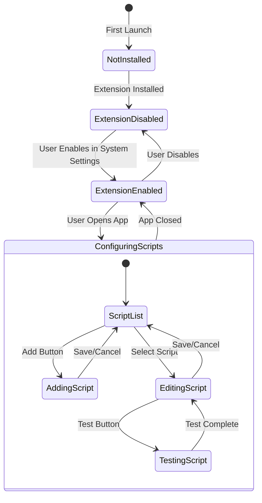
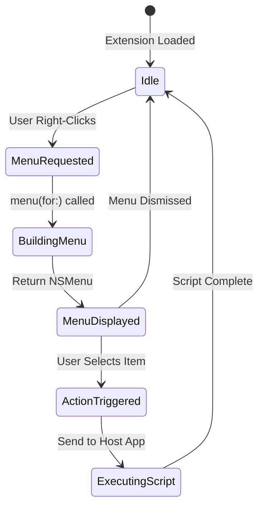
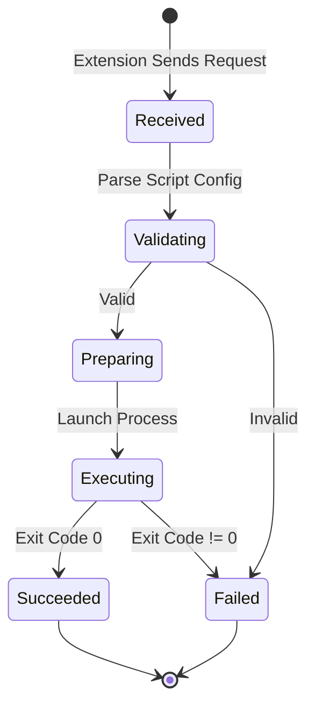

# SaneClick Research Document

> **Single Source of Truth** - All research findings, API documentation, and architectural decisions.
>
> Last Updated: 2026-03-16

## 2026-03-16 App Store Donation Rejection

- Fresh App Store Connect review fetch on the mini confirmed the current macOS blocker is no longer the older entitlement or reopen issue.
- Apple rejected `1.1.0` under guideline `3.1.1` because the app allows donations outside In-App Purchase.
- Local code trace matched that exactly:
  - SaneClick's About tab uses shared `SaneAboutView`.
  - Shared `SaneAboutView` always rendered a `Donate` button, GitHub Sponsors link, and crypto addresses.
  - That support surface is acceptable for direct builds but not for the App Store variant.
- Safe fix chosen:
  - keep the shared About layout and diagnostics flow
  - hide only the support/donation section in `APP_STORE` builds
  - leave direct builds unchanged
- Validation work on the mini:
  - `swift test` in `infra/SaneUI` passed after adding the support-visibility policy tests
  - direct `xcodebuild` App Store build for SaneClick succeeded once the caller-side boolean was simplified
  - SaneMaster's `verify` path briefly failed because the new package-only helper was referenced from the app target; fixing that by passing a compile-time boolean resolved the compile failure
- Process gap found:
  - `./scripts/SaneMaster.rb appstore_preflight` gave a false-green before this work because it does not currently audit shared SaneUI donation/support surfaces
  - preflight should eventually flag App Store builds that expose Donate / GitHub Sponsors / crypto support UI

## 2026-03-23 Live ASC Recheck

- Live ASC app list on the Mini now shows `macOS 1.1.1 Ready for Review`, but the latest submission detail still shows unresolved issues. Treat the lane as still risky until Apple clears it.
- Apple guideline `2.1(b)` requires the IAP to be visible and functional for review.
- Current code appears to have removed the old donation/support surface from the shared About screen, so the older `3.1.1` complaint may already be addressed in source.
- Current review discoverability is still weak:
  - review notes point to onboarding final screen or `Settings > License`
  - the app's main surface is still primarily about folders and library browsing, not an obvious App Store unlock path
- Safe next step is to verify the App Store build on the Mini and make the StoreKit upgrade path explicit in the main app flow, not only in reviewer notes.

## 2026-03-23 Finder Sync launch false-negative + screenshot harness

- Fresh Mini repro on 2026-03-23 confirmed a real Finder Sync API false negative:
  - `pluginkit -m -v -i com.saneclick.SaneClick.FinderSync` reported the extension enabled
  - `swift -e 'import FinderSync; print(FIFinderSyncController.isExtensionEnabled)'` returned `false`
- Root cause for the repeated launch prompt was local app code in `SaneClickApp.init()` auto-calling `FIFinderSyncController.showExtensionManagementInterface()` one second after launch.
- Correct fix is to remove the launch-time auto-open and use `pluginkit` parsing for extension status instead of trusting `FIFinderSyncController.isExtensionEnabled` on the Mini.
- Post-fix Mini runtime proof:
  - built `SaneClick-AppStore` launched and stayed running
  - `System Settings` remained closed after launch
- Separate tooling issue:
  - the dedicated `SaneClick-AppStore-Screenshots` XCTest bundle still fails to load under `Release-AppStore`
  - error is not the app crashing; it is XCTest rejecting `SaneClickAppStoreScreenshotTests.xctest` with a non-platform code-sign mismatch
  - the dedicated screenshot bundle still ends up `adhoc,linker-signed` even after enabling signing in project config
- Safer screenshot path:
  - render the App Store UI through the normal `SaneClickTests/AppStoreScreenshotRenderTests`
  - build the normal `SaneClick` scheme
  - force `APP_STORE` compile flags during the screenshot run
  - this keeps Sparkle available to the host binary while still rendering the App Store copy and layout

## 2026-03-23 Screenshot harness duplicate-file drift

- After the upsell rewrite, Mini `verify` still ran the old screenshot test path even though `Tests/AppStoreScreenshotRenderTests.swift` had been patched to require `SANECLICK_CAPTURE_SCREENSHOTS=1`.
- Local proof on the Mini:
  - `Tests/AppStoreScreenshotRenderTests.swift` contains the new env guard.
  - The failing runtime line numbers and repo search show the test runner is still picking up a duplicate root-level `AppStoreScreenshotRenderTests.swift` that does not have the guard.
  - The same duplicate-file drift exists for `capture_appstore_screenshots.sh`: the root-level copy still lacks `SANECLICK_CAPTURE_SCREENSHOTS=1` while `scripts/capture_appstore_screenshots.sh` is correct.
- Root cause:
  - stale duplicate root-level files were still part of the active Xcode/test path, so editing the `Tests/` and `scripts/` copies alone was not enough.
- Fix rule:
  - remove or sync duplicate test/script files so the project has one authoritative screenshot test file and one authoritative screenshot script path.
  - rerun Mini `verify` only after the active Xcode path is corrected.

## 2026-03-23 Shared WelcomeGate compile rule

- After pushing the shared `WelcomeGateView` override API, Mini compile failed in the SwiftPM checkout with:
  - `function declares an opaque return type, but has no return statements in its body from which to infer an underlying type`
- Root cause:
  - `private var selectionView: some View` was changed to include local `let` bindings before the final `VStack`, and the compiler in the active toolchain rejected that pattern for this opaque-return computed property.
- Fix:
  - move the resolved Pro title/price into separate computed properties instead of local bindings inside `selectionView`.
  - resync the corrected `WelcomeGateView.swift` into the active SwiftPM checkout path before rerunning Mini verify.

## 2026-03-23 SwiftPM cache hash mismatch

- After the shared fix was pushed, Mini SwiftPM resolution still failed even with the new revision in `Package.resolved`.
- Local proof:
  - Xcode's package bare repo cache on the Mini did not yet contain the new SaneUI commit, so checkout failed first.
  - After fetching `main` directly into the active SaneUI bare repo cache, the real fetched commit was `b44df501ec7d3ce899d04387760bd8260e87cc3f`.
  - The manually edited `Package.resolved` revision was wrong (`b44df500...`), so Xcode still could not check out the requested tree.
- Fix:
  - pin `Package.resolved` to the exact fetched revision `b44df501ec7d3ce899d04387760bd8260e87cc3f`.
  - keep the Mini package cache refreshed before rerunning `verify`.

## 2026-03-23 Screenshot test target leak

- The App Store screenshot renderer was being compiled into both:
  - the normal `SaneClickTests` bundle
  - the dedicated `SaneClickAppStoreScreenshotTests` bundle
- That is why regular `verify` kept tripping over screenshot-only behavior, and why adding a runtime env guard made the dedicated screenshot lane falsely pass without generating PNGs.
- Root cause:
  - `project.yml` included all of `Tests/` for `SaneClickTests`, so `AppStoreScreenshotRenderTests.swift` leaked into the normal unit-test target.
- Correct fix:
  - exclude `AppStoreScreenshotRenderTests.swift` from `SaneClickTests`
  - keep it only in `SaneClickAppStoreScreenshotTests`
  - remove the runtime skip guard so the dedicated screenshot bundle always renders or fails loudly

## 2026-03-23 Screenshot target leak follow-up: stale xcodeproj state

- After fixing the source manifest, Mini `verify` still ran `AppStoreScreenshotRenderTests` inside the normal `SaneClickTests` bundle.
- The source of truth split was:
  - `project.yml` correctly excluded `AppStoreScreenshotRenderTests.swift` from `SaneClickTests`
  - the live `.xcodeproj/project.pbxproj` still had `AppStoreScreenshotRenderTests.swift in Sources` attached to both `SaneClickTests` and `SaneClickAppStoreScreenshotTests`
- Root cause:
  - the project file itself was stale, so `verify` kept using the old target membership even though the manifest was already fixed.
- Fix rule:
  - after changing target membership in `project.yml`, regenerate the project and sync the resulting `.xcodeproj` before trusting Mini `verify`.

## 2026-03-23 Mini verify "tests passed" but lane still failed

- Apple docs on `Running tests and interpreting results` emphasize that the `.xcresult` bundle is the canonical source for test-run details, not just the summarized terminal output.
- Local Mini proof:
  - `test_output.txt` only showed `✘ Test run with 81 tests in 12 suites failed after 0.141 seconds with 2 issues.` and did not print the actual expectation messages.
  - `xcresulttool` at `actionResult.issues.testFailureSummaries` revealed the real cause immediately.
- Real root cause:
  - the failing issues were both from `AppStoreReviewGuardrailTests.appStoreUpsellIsVisibleAcrossPrimarySurfaces()`
  - the test incorrectly looked for `Unlock Pro —` and `Restore Purchases` in `SettingsView.swift`
  - those strings actually live in shared SaneUI `LicenseSettingsView.swift`, not in the local wrapper view
- Supporting external pattern:
  - GitHub issue searches around `xcresult` / `all tests passed but xcodebuild failed` consistently point back to session-level or summary-hidden failures, which matches what happened here: the plain log was not enough, the `xcresult` issue summaries were.
- Fix rule:
  - when `verify` says `tests failed ... with N issues` but the terminal log looks green, inspect `xcresult actionResult.issues.testFailureSummaries` before changing code.
  - App Store guardrail tests must assert against the real source file that owns the copy, not a wrapper that only embeds the component.

## 2026-03-12 App Review Recheck

- Live App Store Connect recheck confirmed macOS version `1.1.0 (1101)` is still `REJECTED / UNRESOLVED_ISSUES`.
- The current rejection has two concrete blockers:
  - `5.2.5 Legal`: App Store subtitle must avoid Apple product wording. The old subtitle used `Finder`; current source should keep that out of the subtitle entirely.
  - `2.1 App Completeness`: `Open Settings / Open SaneClick` did not respond during review.
- Local code trace found a real reopen bug in the Finder extension path:
  - `FinderSync.openMainApp()` only called `NSRunningApplication.activate(...)` when the host app was already running.
  - If the host app was alive with no visible window, activation could succeed without reopening the main window, matching the reviewer symptom exactly.
- Fresh implementation rule for this bug family:
  - Extension must send an explicit cross-process `open main window` request.
  - Host app must observe that request and reopen or create the main window on the main actor.
- Apple/local pattern check:
  - Finder Sync extensions are long-lived and should use simple IPC for host-app coordination.
  - Our own existing research already chose `DistributedNotificationCenter` for simple extension ↔ host-app messaging, so using it for the reopen request is consistent with the current architecture.
- Current ASC IAP state for `com.saneclick.app.pro.unlock` is `DEVELOPER_ACTION_NEEDED`.
  - Direct ASC API inspection showed the specific broken subresource is the IAP localization, which is in `REJECTED`.
  - Review screenshot and availability are both complete, so the localization must be refreshed before resubmission.

## 2026-03-26 App Store Metadata Research

- Fresh Apple guidance review:
  - App Store product page guidance says the subtitle should summarize the app's value in a short phrase, the description should open with one strong sentence, and promotional text should communicate current value without turning into review-note/debug copy.
  - App Review guidance plus the current `3.1.1` / `2.1(b)` rejection mean the SaneClick review notes must explicitly say Basic is free, Pro is a one-time StoreKit purchase, where `Unlock Pro` is visible in the app, and that no donation or outside-payment path exists in the App Store build.
- Competitor pattern review for Mac utility listings:
  - strong listings use short value-first subtitles and concrete verb-based descriptions
  - vague upgrade language performs worse than showing the exact tool category and what Pro adds
- Applied copy rule for SaneClick:
  - subtitle should stay Apple-product-neutral
  - description should clearly separate Free from Pro
  - review notes should explicitly say `No external checkout or license key flow exists in this build`
- Mini verification lesson from this pass:
  - the apparent SaneClick `verify` failure was operator-caused, not an app regression
  - running `./scripts/SaneMaster.rb verify` and `./scripts/SaneMaster.rb appstore_preflight` in parallel on the same Mini checkout caused the shared cleanup logic to kill the active test run before an `.xcresult` bundle was produced
  - direct Mini `xcodebuild test` with the same unsigned flags passed `81` tests cleanly
  - SaneClick verification and App Store preflight must be run sequentially, not in parallel

---

## Table of Contents

1. [Project Overview](#project-overview)
2. [Finder Sync Extension API](#finder-sync-extension-api)
3. [Similar Projects Analysis](#similar-projects-analysis)
4. [Semiotic Design Principles](#semiotic-design-principles)
5. [State Machine](#state-machine)
6. [Architecture Decisions](#architecture-decisions)
7. [Testing Strategy](#testing-strategy)
8. [Lessons Learned](#lessons-learned)
9. [Known Bugs](#known-bugs)

---

## Project Overview

**SaneClick** - Finder context menu customization for macOS

**Problem**: macOS lacks easy customization of Finder's right-click context menu. Users want to run custom scripts on selected files/folders.

**Solution**: A native macOS app using Finder Sync Extension API to inject custom menu items that execute user-defined scripts (AppleScript, Bash, Automator workflows).

**Competitors**:
- Context Menu ($9.99) - Full-featured but paid
- Menuist ($0.99) - Basic
- Service Station ($14.99) - Complex
- FiScript (MIT, abandoned 5+ years) - Inspiration, no longer maintained

**Target**: macOS 14+, Apple Silicon (M1+), MIT license

---

## Finder Sync Extension API

### Core Classes

| Class | Purpose |
|-------|---------|
| `FIFinderSync` | Main extension class - subclass this |
| `FIFinderSyncController` | Configure watched folders, manage badges |

### Key Methods

```swift
// FIFinderSync subclass
override init() {
    super.init()
    // Set watched directories
    FIFinderSyncController.default().directoryURLs = [URL(fileURLWithPath: "/")]
}

// Provide context menu
override func menu(for menuKind: FIMenuKind) -> NSMenu {
    let menu = NSMenu(title: "")
    let item = menu.addItem(withTitle: "My Action", action: #selector(actionHandler), keyEquivalent: "")
    return menu
}

// Handle menu selection
@objc func actionHandler(_ sender: NSMenuItem) {
    guard let items = FIFinderSyncController.default().selectedItemURLs() else { return }
    // Execute script on items
}
```

### Menu Kinds

| Menu Kind | Trigger | Use |
|-----------|---------|-----|
| `FIMenuKindContextualMenuForItems` | Right-click on files/folders | Actions on selected items |
| `FIMenuKindContextualMenuForContainer` | Right-click on window background | Actions on current folder |
| `FIMenuKindContextualMenuForSidebar` | Right-click on sidebar | Actions on sidebar folder |
| `FIMenuKindToolbarItemMenu` | Toolbar button click | Global actions |

### Required Info.plist (Extension Target)

```xml
<key>NSExtension</key>
<dict>
    <key>NSExtensionPointIdentifier</key>
    <string>com.apple.FinderSync</string>
    <key>NSExtensionPrincipalClass</key>
    <string>$(PRODUCT_MODULE_NAME).FinderSync</string>
</dict>
```

### Required Entitlements

```xml
<!-- App Group for shared data between app and extension -->
<key>com.apple.security.application-groups</key>
<array>
    <string>group.com.saneclick.app</string>
</array>
```

### Critical Limitations

1. **Extension is long-lived** - Runs as long as Finder runs. Must manage resources carefully.
2. **Multiple instances** - One for Finder + one per Open/Save dialog
3. **No sync functionality** - Extension only handles UI; script execution must be delegated
4. **`targetedURL`/`selectedItemURLs` scope** - Only valid inside `menu(for:)` or menu action handlers
5. **User must enable manually** - System Settings > Privacy & Security > Extensions > Finder

### Communication Pattern

Extension ↔ Host App communication options:
1. **App Groups + UserDefaults** - For configuration (which scripts, watched paths)
2. **XPC** - For script execution requests
3. **MMWormhole** - FiScript used this (third-party library)
4. **DistributedNotificationCenter** - For simple messages

**Chosen**: App Groups + UserDefaults for config, NSDistributedNotificationCenter for execution requests

---

## Similar Projects Analysis

### FiScript (github.com/Mortennn/FiScript)

**Status**: MIT, abandoned since 2022

**Architecture**:
```
FiScript/
├── FiScript/           # Host app (settings UI)
├── Finder Extension/   # FinderSync extension
└── Common/             # Shared code (preferences, models)
```

**Key Patterns**:
- Uses MMWormhole for IPC between extension and host app
- Launches helper app to execute scripts (avoids sandbox restrictions)
- Stores scripts inline or as file paths
- Watches all directories by default (`/`)

**Learnings**:
- Helper app pattern for script execution
- Shared preferences via App Group
- Image data stored with menu items for icons

### FinderEx (github.com/yantoz/FinderEx)

**Status**: GPL, actively maintained

**Architecture**:
```
FinderEx/
├── FinderEx/              # Host app (menu editor)
├── FinderEx Context Menu/ # FinderSync extension
└── FinderEx Helper/       # Script executor
```

**Key Patterns**:
- YAML config file (`~/Library/FinderEx/config.yaml`)
- File type categories (Image files, Document files, etc.)
- Supports AppleScript, Bash, Automator workflows
- System-wide config at `/Library/FinderEx/` + user config at `~/Library/`

**Learnings**:
- Category-based menu organization is good UX
- Separate helper for script execution
- YAML for human-readable config

---

## Semiotic Design Principles

### Core Concepts

| Concept | Definition | Application |
|---------|------------|-------------|
| **Icon** | Resembles what it represents | Use recognizable SF Symbols |
| **Index** | Points to/indicates | Arrow icons for "Open with" |
| **Symbol** | Arbitrary learned meaning | Menu structure conventions |

### Affordance & Signifiers

**Affordance**: What an element CAN do
**Signifier**: Visual cue showing what it CAN do

| UI Element | Affordance | Signifier |
|------------|------------|-----------|
| Add button | Creates new item | Plus (+) icon |
| Script item | Can be clicked | Hover highlight, arrow |
| Drag handle | Can be reordered | Grip lines (≡) |
| Toggle | Can be on/off | Switch appearance |

### Icon Choices for SaneClick

| Action | SF Symbol | Rationale |
|--------|-----------|-----------|
| Add script | `plus.circle` | Universal "add" |
| Remove | `trash` | Universal "delete" |
| Edit | `pencil` | Universal "edit" |
| Run/Execute | `play.fill` | Universal "play/run" |
| AppleScript | `applescript` | Apple's own icon |
| Bash/Terminal | `terminal` | Developer convention |
| Automator | `gearshape.2` | Workflow/automation |
| Folder | `folder` | File system |
| File | `doc` | Document |
| Settings | `gearshape` | Universal "settings" |

### Color Semantics

| Color | Meaning | Use |
|-------|---------|-----|
| Teal (primary) | Brand, interactive | Buttons, links |
| Green | Success, enabled | Active scripts |
| Red | Danger, destructive | Delete, errors |
| Yellow | Warning, caution | Validation warnings |
| Gray | Disabled, secondary | Inactive items |

### Layout Principles

1. **F-pattern reading** - Important items top-left
2. **Proximity** - Related items grouped
3. **Hierarchy** - Size/weight indicates importance
4. **Consistency** - Same action = same icon everywhere

---

## State Machine

### Main App States



### Extension States



### Script Execution Flow



### State Details

| State | Properties | Entry Action | Exit Action |
|-------|------------|--------------|-------------|
| NotInstalled | isFirstLaunch=true | Show onboarding | Install extension |
| ExtensionDisabled | extensionEnabled=false | Show enable prompt | - |
| ExtensionEnabled | extensionEnabled=true | Load config | Save config |
| ScriptList | scripts: [Script] | Load from UserDefaults | - |
| EditingScript | currentScript: Script | Populate form | Validate |
| ExecutingScript | process: Process | Launch process | Cleanup |

### Invariants

| Invariant | Enforced By | Violation Impact |
|-----------|-------------|------------------|
| Extension bundle inside app bundle | Build system | Won't load |
| App Group identifier matches | Entitlements | No shared data |
| Scripts array never nil | Default empty array | Crash prevention |
| Script name unique | Validation on save | Duplicate confusion |

---

## Architecture Decisions

### Decision 1: IPC Mechanism

**Options**:
1. XPC Service - Most secure, complex setup
2. MMWormhole - Third-party, proven in FiScript
3. DistributedNotificationCenter - Simple, built-in
4. App Groups + Polling - Simple but laggy

**Decision**: DistributedNotificationCenter + App Groups

**Rationale**:
- Built-in, no dependencies
- Notifications are immediate
- Config stored in shared UserDefaults
- Script execution happens in host app (not sandboxed extension)

### Decision 2: Script Storage

**Options**:
1. Inline in UserDefaults - Simple, size limited
2. Files in App Support - Unlimited size
3. YAML config like FinderEx - Human-editable

**Decision**: JSON in App Support + inline for small scripts

**Rationale**:
- JSON is native to Swift (Codable)
- Files allow large scripts
- App Support is standard location

### Decision 3: UI Framework

**Options**:
1. SwiftUI - Modern, declarative
2. AppKit - Mature, full control
3. Hybrid - SwiftUI with AppKit interop

**Decision**: Pure SwiftUI

**Rationale**:
- Simpler codebase
- macOS 14+ target supports all needed features
- Consistent with other SaneApps

### Decision 4: Script Execution

**Options**:
1. In-extension execution - Sandboxed, limited
2. Host app execution - Full access, requires app running
3. Helper tool (LaunchAgent) - Background, persisted

**Decision**: Host app execution with background support

**Rationale**:
- Simpler than LaunchAgent setup
- App can be backgrounded (LSUIElement)
- User can see execution status

---

## Testing Strategy

### Design for Testability

1. **Flat UI hierarchy** - No deeply nested views
2. **Accessibility identifiers on ALL interactive elements**
3. **State exposed via @Observable** - Testable without UI
4. **Protocol-based services** - Mockable dependencies

### Test Categories

| Category | Tool | What |
|----------|------|------|
| Unit | Swift Testing | Models, services, parsing |
| UI | XCTest UI | Navigation, forms |
| Integration | Manual + macos-automator | Full flow |

### Automation Points

```swift
// Every interactive element needs an identifier
.accessibilityIdentifier("addScriptButton")
.accessibilityIdentifier("scriptList")
.accessibilityIdentifier("scriptNameField")
.accessibilityIdentifier("scriptTypeSelector")
.accessibilityIdentifier("saveButton")
```

### Test Scenarios

1. **First launch** → Onboarding shown → Extension enable prompt
2. **Add script** → Form validates → Script appears in list
3. **Edit script** → Changes saved → Extension sees update
4. **Delete script** → Confirmation → Removed from list
5. **Right-click in Finder** → Custom menu appears → Script executes

---

## Finder Extension Debugging

### Verification Commands

```bash
# Check extension registration (SOURCE OF TRUTH)
# + means enabled, - means disabled
pluginkit -m -v -p com.apple.FinderSync

# Check if extension process is running
pgrep -l SaneClickExtension

# Check what's in the app bundle
ls -la /Applications/SaneClick.app/Contents/PlugIns/

# Check Info.plist in built extension
defaults read /Applications/SaneClick.app/Contents/PlugIns/SaneClickExtension.appex/Contents/Info.plist NSExtension
```

### Common Issues

| Issue | Symptom | Fix |
|-------|---------|-----|
| Extension not registered | No output from pluginkit | Run: `pluginkit -a /path/to/Extension.appex` |
| Extension disabled | `-` prefix in pluginkit | Run: `pluginkit -e use -i <bundle-id>` |
| System Settings wrong category | Shows "File Provider" | **Known bug** - pluginkit is source of truth, ignore UI |
| Extension not loading | No process running | Restart Finder: `killall Finder` |
| Stale registration | Old path in pluginkit | Unregister: `pluginkit -r /old/path.appex` then re-add |

### Nuclear Reset (Last Resort)

```bash
# 1. Unregister extension
pluginkit -e ignore -i com.saneclick.SaneClick.FinderSync
pluginkit -r /Applications/SaneClick.app/Contents/PlugIns/SaneClickExtension.appex

# 2. Kill processes
killall SaneClickExtension 2>/dev/null || true
killall SaneClick 2>/dev/null || true

# 3. Reset Launch Services (optional, takes time)
/System/Library/Frameworks/CoreServices.framework/Frameworks/LaunchServices.framework/Support/lsregister -kill -r -domain local -domain system -domain user

# 4. Delete and reinstall app
rm -rf /Applications/SaneClick.app
cp -R /path/to/fresh/build/SaneClick.app /Applications/

# 5. Re-register extension
pluginkit -a /Applications/SaneClick.app/Contents/PlugIns/SaneClickExtension.appex
pluginkit -e use -i com.saneclick.SaneClick.FinderSync

# 6. Restart Finder
killall Finder
```

### Key Insight

**System Settings may show extension under wrong category (e.g., "File Provider") due to macOS cache issues.** This is a known bug in macOS Sequoia. Always use `pluginkit -m -v -p com.apple.FinderSync` as the authoritative source - if it shows the extension with `+`, it's working regardless of what System Settings displays.

---

## Lessons Learned

### From Memory MCP (SaneApps patterns)

1. **Bundle ID matters** - Debug vs Release bundle IDs
2. **Autosave can corrupt** - NSStatusItem autosaveName issues
3. **Test on fresh profile** - Corruption may be user-specific
4. **Clean launch pattern** - `killall AppName; sleep 1; open app`

### From FiScript/FinderEx

1. **Helper app pattern** - Extension can't do everything
2. **Watch all paths** - Setting `/` as watched works fine
3. **Menu rebuild on demand** - Don't cache, rebuild each time
4. **Store image data** - Icons can be stored with menu items

### From Semiotics Research

1. **Universal icons exist** - Use SF Symbols, not custom art
2. **Affordance > decoration** - If it looks clickable, it must be
3. **Consistency reduces cognitive load** - Same icon = same action
4. **Cultural neutrality** - Avoid region-specific symbols

---

## Known Bugs

## App Store Settings Launch + Metadata Clarity | Updated: 2026-03-12 | Status: verified | TTL: 30d

- Official Apple docs confirm the correct SwiftUI APIs for opening a settings scene are `SettingsLink` and `EnvironmentValues.openSettings`, not relying only on the legacy `showSettingsWindow:` responder-chain selector.
- In SaneClick, review-facing buttons `Manage Folders` and `Open Settings` were wired only through `NSApp.sendAction(Selector(("showSettingsWindow:")), to: nil, from: nil)`, which can no-op if the responder chain is missing or not active.
- SaneHosts already uses a safer pattern: AppKit posts a notification and a SwiftUI view modifier handles it with `@Environment(\\.openSettings)`.
- App Review rejection on 2026-03-12 for SaneClick 1.1.0 had two concrete causes:
  - Metadata issue: subtitle used the Apple trademark term `Finder` inappropriately.
  - App completeness issue: tapping `Open Settings/Open SaneClick` did nothing.
- Operational guidance: for Mac App Store review notes, prefer `core features are included with the app download` over `Basic is free` unless the lane is actually priced Free in App Store Connect.

### BUG-001: File Picker Dialog Not Appearing (Import Scripts)

**Status**: RESOLVED (2026-02-03)
**Severity**: Critical
**Date Identified**: 2026-01-19

#### Description

The Import Scripts functionality did not display a file picker dialog when triggered from a menu command. The function was confirmed to be called (via debug alert and logs), but neither NSOpenPanel nor SwiftUI's `.fileImporter` modifier displayed the dialog.

#### Reproduction Steps

1. Launch SaneClick
2. Click File > Import Scripts... (or press Cmd+O)
3. Expected: File picker dialog appears
4. Actual: Nothing happens, no dialog appears

#### Root Cause Analysis

- **Confirmed NOT the cause**: Function not being called (debug alert proved function executes)
- **Suspected**: Window style or SwiftUI view hierarchy issue
- **Suspected**: `.hiddenTitleBar` window style interfering with modal presentation

#### Attempts to Fix

| Attempt | Approach | Result |
|---------|----------|--------|
| 1 | `NSOpenPanel.runModal()` | Dialog not shown |
| 2 | `DispatchQueue.main.async { panel.runModal() }` | Dialog not shown |
| 3 | `panel.begin { }` completion handler | Dialog not shown |
| 4 | `panel.beginSheetModal(for: window)` | Logs show window found, method called, but no sheet |
| 5 | SwiftUI `.fileImporter` modifier with `@State` | State changes to true, dialog not shown |
| 6 | Added delay before setting state | Dialog not shown |
| 7 | Changed toolbar button from Menu to direct Button | Dialog not shown |
| 8 | Disabled `.hiddenTitleBar` window style | Testing... |
| 9 | Changed toolbar placement from `.automatic` to `.navigation` | Testing... |

#### Environment

- macOS 15 (Sequoia)
- SwiftUI app with NavigationSplitView
- WindowGroup with `.hiddenTitleBar` (now temporarily disabled)

#### Reference Code

**Current ContentView.swift toolbar:**
```swift
ToolbarItem(placement: .navigation) {
    Button {
        showFileImporter = true
    } label: {
        Label("Import", systemImage: "square.and.arrow.down")
    }
}

// Modifier on body
.fileImporter(
    isPresented: $showFileImporter,
    allowedContentTypes: [.json],
    allowsMultipleSelection: true
) { result in
    // Handle result
}
```

**AppCommands triggering via NotificationCenter:**
```swift
Button("Import Scripts...") {
    NotificationCenter.default.post(name: .importScriptsRequested, object: nil)
}
.keyboardShortcut("o", modifiers: .command)
```

#### Similar Issues Found

- GitHub pattern from Kyome22/LegoArtSwift showed using `beginSheetModal(for:)` but this also didn't work
- Other SwiftUI apps with hidden title bars may have similar issues

#### Fix Implemented

- File > Import now opens a dedicated Import/Export window.
- The window uses `NSOpenPanel` / `NSSavePanel` directly from a button tap.
- No SwiftUI `.fileImporter` is used in menu command flow.

---

## Sources

- [Apple Finder Sync Extension Guide](https://developer.apple.com/library/archive/documentation/General/Conceptual/ExtensibilityPG/Finder.html)
- [FiScript GitHub](https://github.com/Mortennn/FiScript)
- [FinderEx GitHub](https://github.com/yantoz/FinderEx)
- [Semiotics in UI Design - Medium](https://dyessdesign.medium.com/semiotics-the-unspoken-language-of-graphic-design-592db4f6c226)
- [Visual Communication in Software Design](https://medium.com/@dr.arya.design/visual-communication-in-software-design-deciphering-the-semiotic-landscape-for-engaging-user-a46d60606c29)
- [Interaction Design Foundation - Semiotics](https://www.interaction-design.org/literature/book/the-encyclopedia-of-human-computer-interaction-2nd-ed/semiotics)

---

## App Store Redesign | Updated: 2026-03-11 | Status: verified | TTL: 90d

### Review Rejection Root Cause

- Apple rejected SaneClick `1.1.0` under `Guideline 2.4.5(i)` for invalid sandbox entitlements in the App Store host app.
- Rejected keys were `com.apple.security.scripting-targets` for Finder sync and `com.apple.security.temporary-exception.files.home-relative-path.read-write` for `/Library/Application Scripts/com.saneclick.SaneClick/`.
- The old App Store path wrote temporary shell and AppleScript files into `applicationScriptsDirectory` and executed them with `NSUserUnixTask` / `NSUserAppleScriptTask`.
- That design was not App Store safe and also kept the product in a "global Finder script runner" posture that did not match Finder Sync's intended monitored-folder model.

### App Store-Safe Replacement

- App Store build now uses monitored folders chosen by the user instead of all mounted volumes.
- Monitored folders are persisted as security-scoped bookmarks in shared storage and surfaced in Settings.
- Finder Sync only advertises menus inside those monitored folders for `APP_STORE` builds.
- App Store build no longer exposes custom actions or import/export.
- App Store build only exposes a native built-in action subset implemented in Swift, not arbitrary scripts.

### Supported App Store Action Catalog

- Essentials: `Copy Path`, `Copy Filename`, `Open in Terminal`, `New Text File`, `Delete .DS_Store Files`, `Duplicate with Timestamp`, `Get File Info`, `Reveal in Finder`, `Make Executable`
- Files & Folders: `Create Folder from Selection`, `Flatten Folder`, `Organize by Extension`, `Organize by Date`, `Rename with Sequence`, `Lowercase Filenames`, `Replace Spaces with Underscores`
- Advanced: `MD5 Hash`, `SHA256 Hash`

### Required App Store Metadata / Build Notes

- App Store host entitlements now keep sandboxing plus `com.apple.security.files.user-selected.read-write` and `com.apple.security.files.bookmarks.app-scope`.
- Rejected Finder scripting and temporary home-relative entitlements were removed.
- `AppStoreProductID` must be present both in Info.plist generation and in the `Release-AppStore` build settings.
- App Store post-build stripping also removes Sparkle keys and `NSAppleEventsUsageDescription` from the App Store artifact.

### Verification

- `./scripts/SaneMaster.rb verify` passed on the mini with 70 tests after the redesign and new action regression tests.
- `./scripts/SaneMaster.rb appstore_preflight` passed all technical gates after the redesign.
- Remaining preflight warning was only the dirty worktree count during local development.

## Upgrade Surface Verify Recovery | Updated: 2026-04-14 | Status: verified | TTL: 7d

### Sources

- Docs: Swift package / build verification workflow already documented in local `infra/SaneProcess/DEVELOPMENT.md`
- Web: current Swift docs search for generic/nested type usage did not surface any conflicting requirement with the local package path fix
- GitHub: current GitHub search did not show a better pattern than explicit local package references plus direct label interpolation for upgrade buttons
- Local: Mini `xcodebuild`, local project audit, and pricing-surface sweep across onboarding, library locks, and settings

### Findings

- The real Mini compile failure after the pricing copy pass was not the `displayPriceLabel` API itself; the Mini project was still resolving remote `SaneUI` instead of the local monorepo package.
- Syncing `project.yml` plus `SaneClick.xcodeproj/project.pbxproj` to the Mini switched package resolution to `/Users/stephansmac/SaneApps/infra/SaneUI`, after which `xcodebuild -project SaneClick.xcodeproj -scheme SaneClick -configuration Debug -destination platform=macOS build` succeeded.
- The remaining upgrade-surface drift was app-local copy, not package behavior: the welcome gate override used `One-time unlock` instead of the approved numeric price, and several locked-feature CTAs already routed through shared/upgraded price labels.
- Current app-owned onboarding source of truth is `SaneClickWelcomeCopy`; use that for the welcome sheet copy, but keep button labels wired to `licenseService.displayPriceLabel` so StoreKit/local fallback remains centralized.

## Remote SaneUI Source-Build Recovery | Updated: 2026-04-14 | Status: verified | TTL: 7d

### Sources

- Docs: Apple testing docs for [known issues](https://developer.apple.com/documentation/testing/known-issues) and [running tests](https://developer.apple.com/documentation/xcode/running-tests-and-interpreting-results)
- Web: current Swift forums examples showing Swift Testing reports `failed after ... with 1 issue` when a test records an issue even if the suite body otherwise looks clean
- GitHub: current lightweight search did not surface a better SaneClick-specific upstream fix than refreshing the package pin and inspecting the recorded issue directly
- Local: Mini `verify --quiet`, Mini `xcodebuild -resolvePackageDependencies`, local `xcodegen generate`, and live `Package.resolved` comparison

### Findings

- Public source-build release guardrails now require SaneClick to point at `https://github.com/sane-apps/SaneUI.git` instead of the temporary monorepo path.
- Publishing `SaneUI` commit `df151bb842ac785a693fd3e4f440a2e90ab956d9` and resolving packages against that remote commit removed the earlier `displayPriceLabel` compile failure on the Mini.
- The remaining Mini `verify --quiet` failure is not a package-resolution failure. The test run reaches `Test Suite 'All tests' passed` and then Swift Testing reports `Test run with 96 tests in 16 suites failed ... with 1 issue`, so the next diagnosis target is the single recorded issue in the xcresult rather than package wiring.
- Current `test_output.txt` no longer shows the earlier `LicenseService` member error after the remote package pin refresh, so release follow-up should focus on the one Swift Testing issue, not on `SaneUI` drift.
