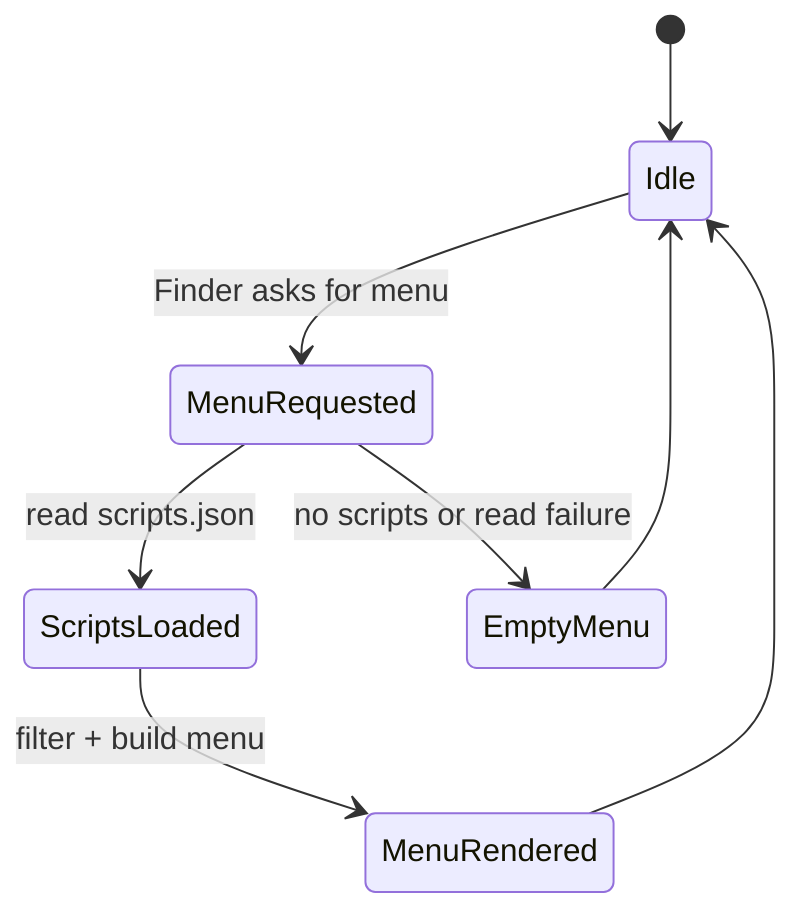
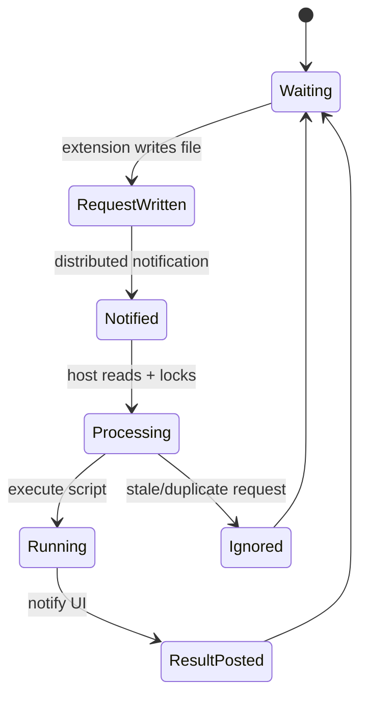

# SaneClick Architecture

Last updated: 2026-02-02

## Purpose

SaneClick is a macOS app + Finder Sync extension that adds curated and custom actions to the Finder right-click menu. The host app manages scripts and settings; the extension renders menus and triggers execution.

## Non-goals

- No cloud sync or analytics for script data.
- No background daemon beyond the Finder Sync extension.
- No direct modification of Finder state outside the Finder Sync API.

## System Context

- **Host app**: SwiftUI app that manages scripts, categories, and updates.
- **Finder Sync extension**: Builds the context menu and triggers script execution.
- **App Group container**: Shared storage and IPC between host + extension.
- **Sparkle**: Update checks via appcast.
- **No GitHub DMG**: DMGs are hosted on Cloudflare R2, not in GitHub.

## Architecture Principles

- Shared data lives in the App Group container so both targets see the same source of truth.
- Extension is read-only on script data; host app owns edits and broadcasts changes.
- File-based IPC (with locking) is favored over direct cross-process calls.
- Fail safe: if App Group is unavailable, fall back to Application Support.

## Core Components

| Component | Responsibility | Key Files |
|---|---|---|
| ScriptStore | Load/save scripts + categories; notifies extension on change | `SaneClick/Services/ScriptStore.swift` |
| ScriptExecutor | Executes bash/AppleScript/Automator workflows | `SaneClick/Services/ScriptExecutor.swift` |
| UpdateService | Sparkle updater wrapper | `SaneClick/Services/UpdateService.swift` |
| FinderSync | Finder context menu + execution trigger | `SaneClickExtension/FinderSync.swift` |
| Script models | Script types, filters, categories | `SaneClick/Models/*` |

## Data and Persistence

- **Scripts**: `scripts.json` in App Group container `M78L6FXD48.group.com.saneclick.app`. Fallback: `~/Library/Application Support/SaneClick/scripts.json`.
- **Categories**: `categories.json` in the same container (same fallback path).
- **Execution requests**: `pending_execution.json` + `.execution.lock` in App Group container.
- **Backups**: ScriptStore writes `*.backup.json` and `*.corrupted.json` when needed.

## Key Flows

### Script Edit -> Extension Menu Refresh
1. User edits scripts in the host app.
2. ScriptStore writes `scripts.json` and posts `com.saneclick.scriptsChanged`.
3. Finder Sync extension rebuilds the menu on next `menu(for:)` call.

### Finder Context Menu -> Script Execution
1. Finder Sync builds the menu from `scripts.json` and current selection.
2. User clicks an item; extension writes `pending_execution.json`.
3. Extension posts `com.saneclick.executeScript` via DistributedNotificationCenter.
4. Host app ScriptExecutor reads request, locks, validates, and executes.
5. Result is posted to UI via `ScriptExecutor.executionCompletedNotification`.

## State Machines

### Finder Menu Rendering

| State | Meaning | Entry | Exit |
|---|---|---|---|
| Idle | Waiting for Finder request | default | menu(for:) |
| MenuRequested | Finder asks for context menu | menu(for:) | scripts loaded |
| ScriptsLoaded | Scripts loaded and filtered | loadScripts() | menu rendered |
| MenuRendered | Menu returned to Finder | menu(for:) return | idle |
| EmptyMenu | Fallback menu (settings only) | load failure | idle |

### Script Execution IPC

| State | Meaning | Entry | Exit |
|---|---|---|---|
| Waiting | No pending request | default | pending_execution.json |
| RequestWritten | Request file exists | extension write | notification |
| Notified | Host is signaled | notification | host read |
| Processing | Lock + validate request | ScriptExecutor | run/ignore |
| Running | Script running (bash/osascript/automator) | execute() | result |
| ResultPosted | UI notified | post notification | waiting |
| Ignored | Duplicate or expired request | validation | waiting |

## Permissions and Privacy

- Finder Sync extension must be enabled in System Settings.
- Script execution is local-only; no telemetry.
- Update checks use Sparkle; only version metadata is transmitted.

## Build and Release Truth

- **Single source of truth**: `.saneprocess` in the project root.
- **Build/test**: `./scripts/SaneMaster.rb verify` (no raw xcodebuild).
- **Release**: `./scripts/SaneMaster.rb release` (delegates to SaneProcess `release.sh`).
- **DMGs**: uploaded to Cloudflare R2 (not committed to GitHub).
- **Appcast**: Sparkle reads `SUFeedURL` from `SaneClick/Info.plist` (saneclick.com).

## Testing Strategy

- Unit tests in `Tests/`.
- Use `./scripts/SaneMaster.rb verify` for build + tests.

## Risks and Tradeoffs

- Finder Sync menu caching can make updates appear stale if script change signals fail.
- App Group container access is required for consistent host/extension behavior.
- Script execution relies on system tools (`/bin/bash`, `/usr/bin/osascript`, `/usr/bin/automator`).
