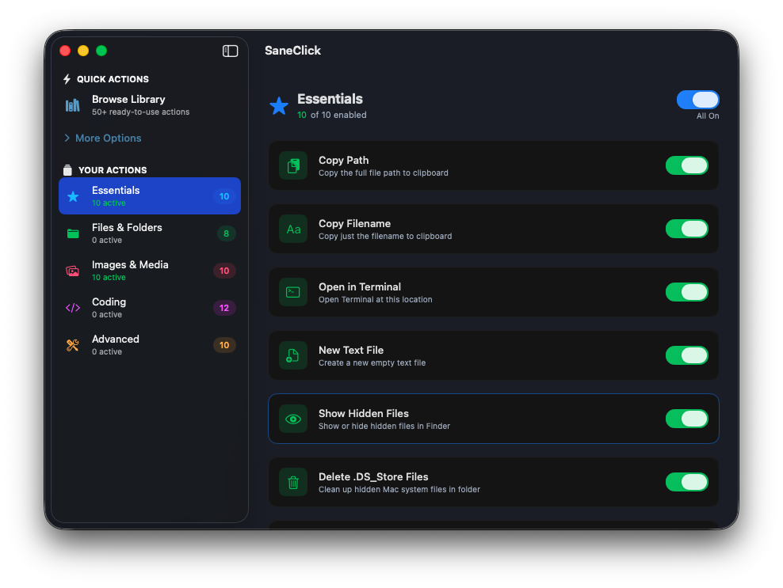

# SaneClick

> 50+ ready-to-use actions for your Finder right-click menu

[](https://github.com/sane-apps/SaneClick/stargazers)
[](LICENSE)
[](https://github.com/sane-apps/SaneClick/releases)
[](https://www.apple.com/macos)

> **⭐ Star this repo if it's useful!** · **[💰 Buy for $6.99](https://saneclick.com)** · Keeps development alive



**🔒 No spying · 💵 No subscription · 🛠️ Actively maintained**

---

## The Problem

Every time you right-click in Finder, you're stuck with Apple's limited context menu. Want to convert an image? Open in Terminal? Run a quick script? You have to leave Finder, open another app, navigate back to your file, and do it manually.

### Why Can't You Fix It Yourself?

macOS has Services and Folder Actions, but they require Automator knowledge or AppleScript expertise. Most people give up before they start.

### Why Alternatives Fail You

The "easy" solutions cost $10-15, require subscriptions, or haven't been updated since 2019. Some are abandonware. Others are overkill.

---

## The Sane Solution

SaneClick gives you **50+ ready-to-use actions** — no scripting required. Browse by category, toggle on what you need, done.

- **Curated Library**: 50+ pre-built actions organized by category
- **One-Click Install**: Toggle actions on/off instantly
- **Smart Filtering**: Actions appear only for matching file types
- **Custom Scripts**: Power users can write Bash, AppleScript, or Automator workflows
- **Categories**: Essentials, Files & Folders, Images & Media, Coding, Advanced

**100% local. We never see your data.**

> *I wanted to make it $5, but processing fees and taxes were... insane. — Mr. Sane*

---

## Features

| Feature | Description |
|---------|-------------|
| **50+ Pre-built Actions** | Copy paths, convert images, open in Terminal, and more |
| **5 Categories** | Essentials, Files & Folders, Images & Media, Coding, Advanced |
| **Smart Filtering** | Actions appear only for matching file types |
| **Selection Count Filtering** | Show actions only for single files or multi-select (min/max) |
| **Extension Match Modes** | "Any file matches" vs "All files must match" |
| **One-Click Install** | Toggle actions on/off instantly |
| **Custom Scripts** | Write Bash, AppleScript, or Automator workflows |
| **Test Before Save** | Run scripts on real files with output preview before committing |
| **Import/Export** | Share scripts as JSON (skip duplicates, update existing, or replace all) |
| **Menu Bar Quick Access** | Status bar icon for quick settings, Finder restart, and updates |
| **Extension Status Monitor** | Color-coded status (green/orange/red) with one-click Finder restart |
| **App Visibility** | Show/hide menu bar icon and Dock icon independently |

---

## Requirements

- macOS 14.0+
- Apple Silicon (arm64) only
- Xcode 16.0+ (for building from source)
- XcodeGen (project generation; SaneMaster runs it for you)

---

## Installation

### Download

[Buy SaneClick](https://saneclick.com) — Signed, notarized, ready to use. Supports sustainable open source development.

### Build from Source

**Building from source?** Consider [buying the app](https://saneclick.com) to support continued development.

```bash
# Clone the repository
git clone https://github.com/sane-apps/SaneClick.git
cd SaneClick

# Build + test (preferred)
./scripts/SaneMaster.rb verify

# Launch
./scripts/SaneMaster.rb launch
```
SaneMaster runs XcodeGen when needed; only run `xcodegen generate` manually if you add files and want to refresh immediately.

### First Launch

On first launch, SaneClick offers curated starter packs by category. Pick the ones that match your workflow and install scripts with one click. Add more anytime from the library.

### Enable the Extension

1. Open SaneClick
2. Go to **System Settings > Privacy & Security > Extensions > Finder**
3. Enable **SaneClick**

### Troubleshooting

Check extension status in **Settings > General**:
- **Green** = Active and working
- **Orange** = Enabled but Finder needs restart (use the "Restart Finder" button)
- **Red** = Disabled — enable in System Settings

---

## Usage

1. **Add Scripts**: Click the + button and choose "New Script"
2. **Configure**: Set name, type (Bash/AppleScript/Automator), content, icon, and file filters
3. **Test**: Use the Test button to select real files and preview output/errors before saving
4. **Organize**: Create custom categories and assign scripts to groups
5. **Use**: Right-click files in Finder to see your scripts
6. **Notifications**: Toggle action completion confirmations in Settings

### Script Variables

| Type | Variables |
|------|-----------|
| **Bash** | `$1`, `$2`, etc. for file paths, or `$@` for all |
| **AppleScript** | `item 1 of argv` to access paths |
| **Automator** | File paths via standard input |

---

## Architecture

See [ARCHITECTURE.md](ARCHITECTURE.md) for the full system overview and state machines.

```
SaneClick/
├── SaneClick/              # Host app (settings UI)
│   ├── Models/              # Script, Category models
│   ├── Services/            # ScriptExecutor, ScriptStore
│   ├── Views/               # SwiftUI views
│   └── Theme/               # Brand colors
├── SaneClickExtension/     # Finder Sync Extension
│   └── FinderSync.swift     # Context menu provider
├── Tests/                   # Unit tests
└── docs/                    # Website
```

---

## Our Promise

> *"For God has not given us a spirit of fear, but of power and of love and of a sound mind."*
> — 2 Timothy 1:7

| Pillar | Meaning |
|--------|---------|
| **⚡ Power** | Your data stays on your device. No cloud, no tracking. |
| **❤️ Love** | Built to serve you. No dark patterns or manipulation. |
| **🧠 Sound Mind** | Calm, focused design. Does one thing well. |

---

## Contributing

Before opening a PR:
1. **[⭐ Star the repo](https://github.com/sane-apps/SaneClick)** (if you haven't already)
2. Read [CONTRIBUTING.md](CONTRIBUTING.md)
3. Open an issue first to discuss major changes

---

## Support

**[⭐ Star the repo](https://github.com/sane-apps/SaneClick)** if SaneClick helps you. Stars help others discover quality open source.

**Cloning without starring?** For real bro? Gimme that star!

- 🐛 [Report a Bug](https://github.com/sane-apps/SaneClick/issues)
- 💡 [Request a Feature](https://github.com/sane-apps/SaneClick/issues)

---

## License

[PolyForm Shield 1.0.0](https://polyformproject.org/licenses/shield/1.0.0) — free for any use except building a competing product. See [LICENSE](LICENSE) for details.

---

Part of the [Sane Apps](https://saneapps.com) family.

<!-- SANEAPPS_AI_CONTRIB_START -->
### Become a Contributor (Even if You Don't Code)

Are you tired of waiting on the dev to get around to fixing your problem?  
Do you have a great idea that could help everyone in the community, but think you can't do anything about it because you're not a coder?

Good news: you actually can.

Copy and paste this into Claude or Codex, then describe your bug or idea:

```text
I want to contribute to this repo, but I'm not a coder.

Repository:
https://github.com/sane-apps/SaneClick

Bug or idea:
[Describe your bug or idea here in plain English]

Please do this for me:
1) Understand and reproduce the issue (or understand the feature request).
2) Make the smallest safe fix.
3) Open a pull request to https://github.com/sane-apps/SaneClick
4) Give me the pull request link.
5) Open a GitHub issue in https://github.com/sane-apps/SaneClick/issues that includes:
   - the pull request link
   - a short summary of what changed and why
6) Also give me the exact issue link.

Important:
- Keep it focused on this one issue/idea.
- Do not make unrelated changes.
```

If needed, you can also just email the pull request link to hi@saneapps.com.

I review and test every pull request before merge.

If your PR is merged, I will publicly give you credit, and you'll have the satisfaction of knowing you helped ship a fix for everyone.
<!-- SANEAPPS_AI_CONTRIB_END -->
