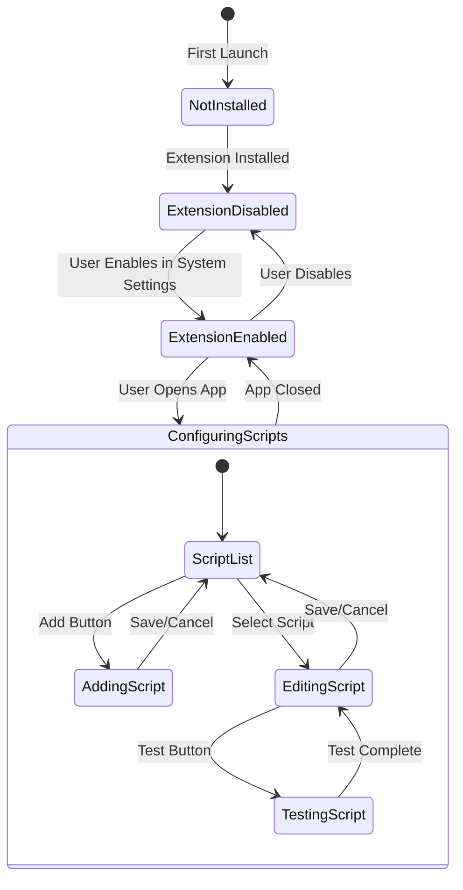
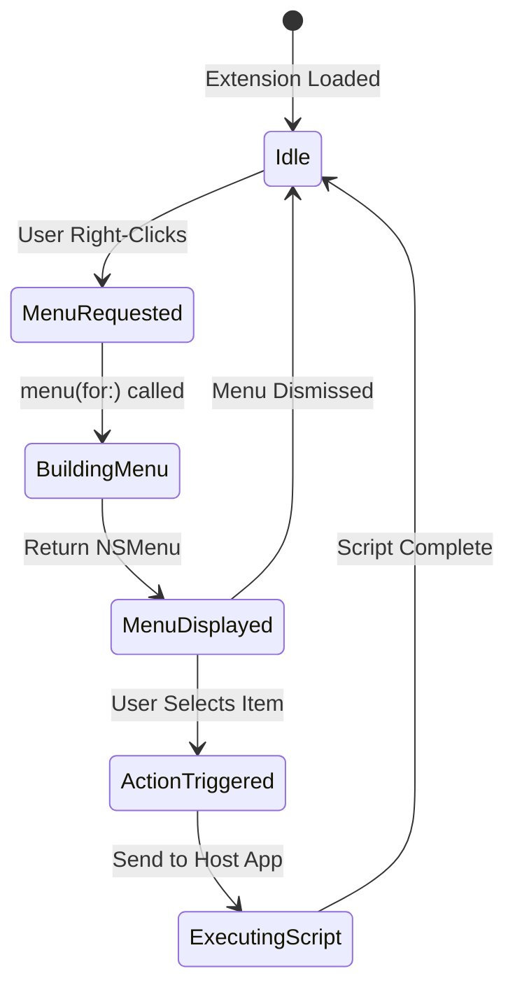
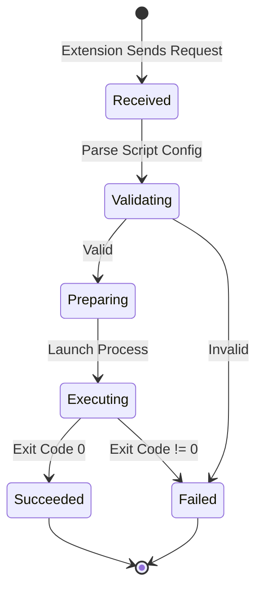

# SaneClick Research Document

> **Single Source of Truth** - All research findings, API documentation, and architectural decisions.
>
> Last Updated: 2026-02-03

---

## Table of Contents

1. [Project Overview](#project-overview)
2. [Finder Sync Extension API](#finder-sync-extension-api)
3. [Similar Projects Analysis](#similar-projects-analysis)
4. [Semiotic Design Principles](#semiotic-design-principles)
5. [State Machine](#state-machine)
6. [Architecture Decisions](#architecture-decisions)
7. [Testing Strategy](#testing-strategy)
8. [Lessons Learned](#lessons-learned)
9. [Known Bugs](#known-bugs)

---

## Project Overview

**SaneClick** - Finder context menu customization for macOS

**Problem**: macOS lacks easy customization of Finder's right-click context menu. Users want to run custom scripts on selected files/folders.

**Solution**: A native macOS app using Finder Sync Extension API to inject custom menu items that execute user-defined scripts (AppleScript, Bash, Automator workflows).

**Competitors**:
- Context Menu ($9.99) - Full-featured but paid
- Menuist ($0.99) - Basic
- Service Station ($14.99) - Complex
- FiScript (MIT, abandoned 5+ years) - Inspiration, no longer maintained

**Target**: macOS 14+, Apple Silicon (M1+), MIT license

---

## Finder Sync Extension API

### Core Classes

| Class | Purpose |
|-------|---------|
| `FIFinderSync` | Main extension class - subclass this |
| `FIFinderSyncController` | Configure watched folders, manage badges |

### Key Methods

```swift
// FIFinderSync subclass
override init() {
    super.init()
    // Set watched directories
    FIFinderSyncController.default().directoryURLs = [URL(fileURLWithPath: "/")]
}

// Provide context menu
override func menu(for menuKind: FIMenuKind) -> NSMenu {
    let menu = NSMenu(title: "")
    let item = menu.addItem(withTitle: "My Action", action: #selector(actionHandler), keyEquivalent: "")
    return menu
}

// Handle menu selection
@objc func actionHandler(_ sender: NSMenuItem) {
    guard let items = FIFinderSyncController.default().selectedItemURLs() else { return }
    // Execute script on items
}
```

### Menu Kinds

| Menu Kind | Trigger | Use |
|-----------|---------|-----|
| `FIMenuKindContextualMenuForItems` | Right-click on files/folders | Actions on selected items |
| `FIMenuKindContextualMenuForContainer` | Right-click on window background | Actions on current folder |
| `FIMenuKindContextualMenuForSidebar` | Right-click on sidebar | Actions on sidebar folder |
| `FIMenuKindToolbarItemMenu` | Toolbar button click | Global actions |

### Required Info.plist (Extension Target)

```xml
<key>NSExtension</key>
<dict>
    <key>NSExtensionPointIdentifier</key>
    <string>com.apple.FinderSync</string>
    <key>NSExtensionPrincipalClass</key>
    <string>$(PRODUCT_MODULE_NAME).FinderSync</string>
</dict>
```

### Required Entitlements

```xml
<!-- App Group for shared data between app and extension -->
<key>com.apple.security.application-groups</key>
<array>
    <string>group.com.saneclick.app</string>
</array>
```

### Critical Limitations

1. **Extension is long-lived** - Runs as long as Finder runs. Must manage resources carefully.
2. **Multiple instances** - One for Finder + one per Open/Save dialog
3. **No sync functionality** - Extension only handles UI; script execution must be delegated
4. **`targetedURL`/`selectedItemURLs` scope** - Only valid inside `menu(for:)` or menu action handlers
5. **User must enable manually** - System Settings > Privacy & Security > Extensions > Finder

### Communication Pattern

Extension ↔ Host App communication options:
1. **App Groups + UserDefaults** - For configuration (which scripts, watched paths)
2. **XPC** - For script execution requests
3. **MMWormhole** - FiScript used this (third-party library)
4. **DistributedNotificationCenter** - For simple messages

**Chosen**: App Groups + UserDefaults for config, NSDistributedNotificationCenter for execution requests

---

## Similar Projects Analysis

### FiScript (github.com/Mortennn/FiScript)

**Status**: MIT, abandoned since 2022

**Architecture**:
```
FiScript/
├── FiScript/           # Host app (settings UI)
├── Finder Extension/   # FinderSync extension
└── Common/             # Shared code (preferences, models)
```

**Key Patterns**:
- Uses MMWormhole for IPC between extension and host app
- Launches helper app to execute scripts (avoids sandbox restrictions)
- Stores scripts inline or as file paths
- Watches all directories by default (`/`)

**Learnings**:
- Helper app pattern for script execution
- Shared preferences via App Group
- Image data stored with menu items for icons

### FinderEx (github.com/yantoz/FinderEx)

**Status**: GPL, actively maintained

**Architecture**:
```
FinderEx/
├── FinderEx/              # Host app (menu editor)
├── FinderEx Context Menu/ # FinderSync extension
└── FinderEx Helper/       # Script executor
```

**Key Patterns**:
- YAML config file (`~/Library/FinderEx/config.yaml`)
- File type categories (Image files, Document files, etc.)
- Supports AppleScript, Bash, Automator workflows
- System-wide config at `/Library/FinderEx/` + user config at `~/Library/`

**Learnings**:
- Category-based menu organization is good UX
- Separate helper for script execution
- YAML for human-readable config

---

## Semiotic Design Principles

### Core Concepts

| Concept | Definition | Application |
|---------|------------|-------------|
| **Icon** | Resembles what it represents | Use recognizable SF Symbols |
| **Index** | Points to/indicates | Arrow icons for "Open with" |
| **Symbol** | Arbitrary learned meaning | Menu structure conventions |

### Affordance & Signifiers

**Affordance**: What an element CAN do
**Signifier**: Visual cue showing what it CAN do

| UI Element | Affordance | Signifier |
|------------|------------|-----------|
| Add button | Creates new item | Plus (+) icon |
| Script item | Can be clicked | Hover highlight, arrow |
| Drag handle | Can be reordered | Grip lines (≡) |
| Toggle | Can be on/off | Switch appearance |

### Icon Choices for SaneClick

| Action | SF Symbol | Rationale |
|--------|-----------|-----------|
| Add script | `plus.circle` | Universal "add" |
| Remove | `trash` | Universal "delete" |
| Edit | `pencil` | Universal "edit" |
| Run/Execute | `play.fill` | Universal "play/run" |
| AppleScript | `applescript` | Apple's own icon |
| Bash/Terminal | `terminal` | Developer convention |
| Automator | `gearshape.2` | Workflow/automation |
| Folder | `folder` | File system |
| File | `doc` | Document |
| Settings | `gearshape` | Universal "settings" |

### Color Semantics

| Color | Meaning | Use |
|-------|---------|-----|
| Teal (primary) | Brand, interactive | Buttons, links |
| Green | Success, enabled | Active scripts |
| Red | Danger, destructive | Delete, errors |
| Yellow | Warning, caution | Validation warnings |
| Gray | Disabled, secondary | Inactive items |

### Layout Principles

1. **F-pattern reading** - Important items top-left
2. **Proximity** - Related items grouped
3. **Hierarchy** - Size/weight indicates importance
4. **Consistency** - Same action = same icon everywhere

---

## State Machine

### Main App States



### Extension States



### Script Execution Flow



### State Details

| State | Properties | Entry Action | Exit Action |
|-------|------------|--------------|-------------|
| NotInstalled | isFirstLaunch=true | Show onboarding | Install extension |
| ExtensionDisabled | extensionEnabled=false | Show enable prompt | - |
| ExtensionEnabled | extensionEnabled=true | Load config | Save config |
| ScriptList | scripts: [Script] | Load from UserDefaults | - |
| EditingScript | currentScript: Script | Populate form | Validate |
| ExecutingScript | process: Process | Launch process | Cleanup |

### Invariants

| Invariant | Enforced By | Violation Impact |
|-----------|-------------|------------------|
| Extension bundle inside app bundle | Build system | Won't load |
| App Group identifier matches | Entitlements | No shared data |
| Scripts array never nil | Default empty array | Crash prevention |
| Script name unique | Validation on save | Duplicate confusion |

---

## Architecture Decisions

### Decision 1: IPC Mechanism

**Options**:
1. XPC Service - Most secure, complex setup
2. MMWormhole - Third-party, proven in FiScript
3. DistributedNotificationCenter - Simple, built-in
4. App Groups + Polling - Simple but laggy

**Decision**: DistributedNotificationCenter + App Groups

**Rationale**:
- Built-in, no dependencies
- Notifications are immediate
- Config stored in shared UserDefaults
- Script execution happens in host app (not sandboxed extension)

### Decision 2: Script Storage

**Options**:
1. Inline in UserDefaults - Simple, size limited
2. Files in App Support - Unlimited size
3. YAML config like FinderEx - Human-editable

**Decision**: JSON in App Support + inline for small scripts

**Rationale**:
- JSON is native to Swift (Codable)
- Files allow large scripts
- App Support is standard location

### Decision 3: UI Framework

**Options**:
1. SwiftUI - Modern, declarative
2. AppKit - Mature, full control
3. Hybrid - SwiftUI with AppKit interop

**Decision**: Pure SwiftUI

**Rationale**:
- Simpler codebase
- macOS 14+ target supports all needed features
- Consistent with other SaneApps

### Decision 4: Script Execution

**Options**:
1. In-extension execution - Sandboxed, limited
2. Host app execution - Full access, requires app running
3. Helper tool (LaunchAgent) - Background, persisted

**Decision**: Host app execution with background support

**Rationale**:
- Simpler than LaunchAgent setup
- App can be backgrounded (LSUIElement)
- User can see execution status

---

## Testing Strategy

### Design for Testability

1. **Flat UI hierarchy** - No deeply nested views
2. **Accessibility identifiers on ALL interactive elements**
3. **State exposed via @Observable** - Testable without UI
4. **Protocol-based services** - Mockable dependencies

### Test Categories

| Category | Tool | What |
|----------|------|------|
| Unit | Swift Testing | Models, services, parsing |
| UI | XCTest UI | Navigation, forms |
| Integration | Manual + macos-automator | Full flow |

### Automation Points

```swift
// Every interactive element needs an identifier
.accessibilityIdentifier("addScriptButton")
.accessibilityIdentifier("scriptList")
.accessibilityIdentifier("scriptNameField")
.accessibilityIdentifier("scriptTypeSelector")
.accessibilityIdentifier("saveButton")
```

### Test Scenarios

1. **First launch** → Onboarding shown → Extension enable prompt
2. **Add script** → Form validates → Script appears in list
3. **Edit script** → Changes saved → Extension sees update
4. **Delete script** → Confirmation → Removed from list
5. **Right-click in Finder** → Custom menu appears → Script executes

---

## Finder Extension Debugging

### Verification Commands

```bash
# Check extension registration (SOURCE OF TRUTH)
# + means enabled, - means disabled
pluginkit -m -v -p com.apple.FinderSync

# Check if extension process is running
pgrep -l SaneClickExtension

# Check what's in the app bundle
ls -la /Applications/SaneClick.app/Contents/PlugIns/

# Check Info.plist in built extension
defaults read /Applications/SaneClick.app/Contents/PlugIns/SaneClickExtension.appex/Contents/Info.plist NSExtension
```

### Common Issues

| Issue | Symptom | Fix |
|-------|---------|-----|
| Extension not registered | No output from pluginkit | Run: `pluginkit -a /path/to/Extension.appex` |
| Extension disabled | `-` prefix in pluginkit | Run: `pluginkit -e use -i <bundle-id>` |
| System Settings wrong category | Shows "File Provider" | **Known bug** - pluginkit is source of truth, ignore UI |
| Extension not loading | No process running | Restart Finder: `killall Finder` |
| Stale registration | Old path in pluginkit | Unregister: `pluginkit -r /old/path.appex` then re-add |

### Nuclear Reset (Last Resort)

```bash
# 1. Unregister extension
pluginkit -e ignore -i com.saneclick.SaneClick.FinderSync
pluginkit -r /Applications/SaneClick.app/Contents/PlugIns/SaneClickExtension.appex

# 2. Kill processes
killall SaneClickExtension 2>/dev/null || true
killall SaneClick 2>/dev/null || true

# 3. Reset Launch Services (optional, takes time)
/System/Library/Frameworks/CoreServices.framework/Frameworks/LaunchServices.framework/Support/lsregister -kill -r -domain local -domain system -domain user

# 4. Delete and reinstall app
rm -rf /Applications/SaneClick.app
cp -R /path/to/fresh/build/SaneClick.app /Applications/

# 5. Re-register extension
pluginkit -a /Applications/SaneClick.app/Contents/PlugIns/SaneClickExtension.appex
pluginkit -e use -i com.saneclick.SaneClick.FinderSync

# 6. Restart Finder
killall Finder
```

### Key Insight

**System Settings may show extension under wrong category (e.g., "File Provider") due to macOS cache issues.** This is a known bug in macOS Sequoia. Always use `pluginkit -m -v -p com.apple.FinderSync` as the authoritative source - if it shows the extension with `+`, it's working regardless of what System Settings displays.

---

## Lessons Learned

### From Memory MCP (SaneApps patterns)

1. **Bundle ID matters** - Debug vs Release bundle IDs
2. **Autosave can corrupt** - NSStatusItem autosaveName issues
3. **Test on fresh profile** - Corruption may be user-specific
4. **Clean launch pattern** - `killall AppName; sleep 1; open app`

### From FiScript/FinderEx

1. **Helper app pattern** - Extension can't do everything
2. **Watch all paths** - Setting `/` as watched works fine
3. **Menu rebuild on demand** - Don't cache, rebuild each time
4. **Store image data** - Icons can be stored with menu items

### From Semiotics Research

1. **Universal icons exist** - Use SF Symbols, not custom art
2. **Affordance > decoration** - If it looks clickable, it must be
3. **Consistency reduces cognitive load** - Same icon = same action
4. **Cultural neutrality** - Avoid region-specific symbols

---

## Known Bugs

### BUG-001: File Picker Dialog Not Appearing (Import Scripts)

**Status**: MITIGATED (2026-02-03)
**Severity**: Critical
**Date Identified**: 2026-01-19

#### Description

The Import Scripts functionality did not display a file picker dialog when triggered from a menu command. The function was confirmed to be called (via debug alert and logs), but neither NSOpenPanel nor SwiftUI's `.fileImporter` modifier displayed the dialog.

#### Reproduction Steps

1. Launch SaneClick
2. Click File > Import Scripts... (or press Cmd+O)
3. Expected: File picker dialog appears
4. Actual: Nothing happens, no dialog appears

#### Root Cause Analysis

- **Confirmed NOT the cause**: Function not being called (debug alert proved function executes)
- **Suspected**: Window style or SwiftUI view hierarchy issue
- **Suspected**: `.hiddenTitleBar` window style interfering with modal presentation

#### Attempts to Fix

| Attempt | Approach | Result |
|---------|----------|--------|
| 1 | `NSOpenPanel.runModal()` | Dialog not shown |
| 2 | `DispatchQueue.main.async { panel.runModal() }` | Dialog not shown |
| 3 | `panel.begin { }` completion handler | Dialog not shown |
| 4 | `panel.beginSheetModal(for: window)` | Logs show window found, method called, but no sheet |
| 5 | SwiftUI `.fileImporter` modifier with `@State` | State changes to true, dialog not shown |
| 6 | Added delay before setting state | Dialog not shown |
| 7 | Changed toolbar button from Menu to direct Button | Dialog not shown |
| 8 | Disabled `.hiddenTitleBar` window style | Testing... |
| 9 | Changed toolbar placement from `.automatic` to `.navigation` | Testing... |

#### Environment

- macOS 15 (Sequoia)
- SwiftUI app with NavigationSplitView
- WindowGroup with `.hiddenTitleBar` (now temporarily disabled)

#### Reference Code

**Current ContentView.swift toolbar:**
```swift
ToolbarItem(placement: .navigation) {
    Button {
        showFileImporter = true
    } label: {
        Label("Import", systemImage: "square.and.arrow.down")
    }
}

// Modifier on body
.fileImporter(
    isPresented: $showFileImporter,
    allowedContentTypes: [.json],
    allowsMultipleSelection: true
) { result in
    // Handle result
}
```

**AppCommands triggering via NotificationCenter:**
```swift
Button("Import Scripts...") {
    NotificationCenter.default.post(name: .importScriptsRequested, object: nil)
}
.keyboardShortcut("o", modifiers: .command)
```

#### Similar Issues Found

- GitHub pattern from Kyome22/LegoArtSwift showed using `beginSheetModal(for:)` but this also didn't work
- Other SwiftUI apps with hidden title bars may have similar issues

#### Workaround Implemented

- File > Import now opens a dedicated Import window with a "Choose JSON File" button.
- File picker is triggered from the window button (not directly from the menu command).

#### Next Steps to Try

1. Remove all NotificationCenter indirection - call panel directly from button
2. Try `NSApp.runModal(for:)` approach
3. Check if window needs to be key window
4. Try DocumentGroup instead of WindowGroup
5. Check Console for SwiftUI errors or warnings

---

## Sources

- [Apple Finder Sync Extension Guide](https://developer.apple.com/library/archive/documentation/General/Conceptual/ExtensibilityPG/Finder.html)
- [FiScript GitHub](https://github.com/Mortennn/FiScript)
- [FinderEx GitHub](https://github.com/yantoz/FinderEx)
- [Semiotics in UI Design - Medium](https://dyessdesign.medium.com/semiotics-the-unspoken-language-of-graphic-design-592db4f6c226)
- [Visual Communication in Software Design](https://medium.com/@dr.arya.design/visual-communication-in-software-design-deciphering-the-semiotic-landscape-for-engaging-user-a46d60606c29)
- [Interaction Design Foundation - Semiotics](https://www.interaction-design.org/literature/book/the-encyclopedia-of-human-computer-interaction-2nd-ed/semiotics)
